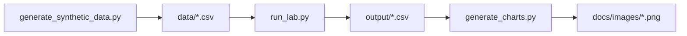

# IBM DataStage + Db2 ETL Lab

**Author:** [Faiz Elahi](https://github.com/faizilahi) (`faizilahi`) · **Type:** EDUCATIONAL LAB · **Synthetic data only**

---

## Educational disclaimer

This is an **educational portfolio lab**. Datasets are **synthetic**. It does **not** claim employment at a customer, hospital, bank, SAP shop, or Oracle estate. No real PHI/PII. No live cloud spend. No API keys required.

---

## Problem statement

Estates still run DataStage jobs into Db2. This lab teaches job stages (extract/transform/load), reject links, and Db2-minded SQL — distinct from the watsonx analytics lab.

**Domain focus:** Enterprise ETL modernization

---

## Why this tool (IBM DataStage-style jobs + Db2 SQL patterns)

| Opaque DSX jobs | Explicit stage graph in code |
|---|---|
| Lost rejects | Reject CSV with reasons |

---

## Architecture



See [`docs/architecture.md`](docs/architecture.md).

---

## Dataset dictionary

| File | Notes |
|------|-------|
| `data/source_customers.csv` | Extract |
| `output/rejects.csv` | Reject link |
| `output/summary.csv` | Load counts |

---

## Prerequisites

- Python 3.10+
- Packages in `requirements.txt`

---

## How to run

```powershell
cd "ibm-datastage-+-db2-etl-lab"
python -m venv .venv
.\\.venv\Scripts\Activate.ps1
pip install -r requirements.txt
python scripts/generate_synthetic_data.py
python src/run_lab.py
python scripts/generate_charts.py
```

Inspect `output/summary.csv` and `docs/images/primary_metric.png`.

---

## Local vs cloud (honest)

Python stages stand in for DataStage; **SQLite** stands in for Db2. Not IBM Cloud or watsonx. See also `ibm-watsonx-analytics-lab` for analytics patterns.

---

## Results interpretation

Open `output/` CSVs and the PNGs under `docs/images/`. Numbers are synthetic teaching fixtures — use them to explain grain, filters, and control totals, not as real business KPIs.

---

## Limitations

- Stand-in engines (DuckDB/SQLite/pandas) replace paid MPP/warehouses where noted.
- Simplified schemas vs production SAP/Oracle/Hive estates.
- Charts are matplotlib teaching visuals, not vendor BI embeds.

---

## Exercises

1. Add a slowly-changing lookup stage.
2. Partition the load by region.
3. Write a DataStage→dbt dual-run checklist.

---

## License / attribution

Educational portfolio content by Faiz Elahi. Synthetic data for teaching only.

